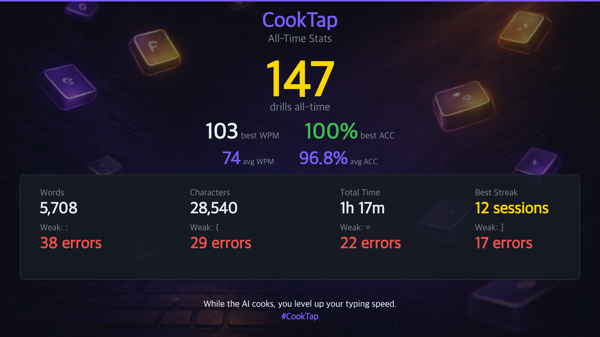

# CookTap

**Terminal typing micro-game for AI coding wait states.**

*While the AI cooks, you level up your typing speed.*


CookTap runs in your terminal while AI coding tools (Claude Code, Codex, Gemini CLI) are thinking. It tracks WPM, accuracy, streaks, ranks, and personal bests — then generates crisp share cards for X/Twitter so you can flex your grind.

## See It In Action


## Install

```bash
npm install -g cooktap
```

Or run directly:

```bash
npx cooktap
```

## Use with AI Coding CLIs

CookTap works with any AI coding CLI. The install experience varies by host:

| CLI | Launch | Done notification |
|-----|--------|-------------------|
| **Claude Code** | Native plugin (`/cooktap` skill) | Full (`Stop` hook) |
| **Codex** | Via `npx skills` | Coming soon |
| **Gemini CLI** | Via `npx skills` | Coming soon |
| **Any other** | `npx cooktap` in a separate tab | — |

### Claude Code (flagship)

CookTap ships as a native Claude Code plugin with a Stop hook and `/cooktap` skill.

**Option A — Plugin install:**

```
/plugin install cooktap
```

**Option B — Setup command:**

```bash
cooktap setup claude
```

This installs a Stop hook in `~/.claude/settings.json` and a `/cooktap` skill. When Claude finishes working, CookTap shows a gold "Claude Code is ready!" banner with a terminal bell.

Preview what it would do first:

```bash
cooktap setup claude --dry-run
```

### Universal (any CLI)

```bash
npx skills add 0xagentkitchen/CookTap
```

This installs a portable SKILL.md that any supported agent can read. The agent can then launch CookTap with `npx cooktap`.

## Categories

Four drill categories targeting different typing skills:

| Category | Content | Count |
|----------|---------|-------|
| **Words** | English text, dev phrases, pangrams | 50 |
| **Code** | JS/TS, React hooks, Go, Python, Rust, SQL, regex | 80 |
| **CLI** | git, docker, kubectl, curl, jq, ssh, aws, npm | 60 |
| **Technique** | Finger drills, row isolation, hand isolation, bigrams | 40 |

**230 drills total.** Each can be played standard (complete the text) or timed (30s / 60s).

### Adaptive Technique Targeting

The Technique category is **smart**. It reads your error heatmap, identifies your weakest keys, and biases drill selection toward the finger/row/hand that trains them. The Category screen shows exactly which keys it's targeting:

```
4. Technique  Finger drills, rows, hand isolation
      Targeting: e s t f v
```

Drills tagged `index-fingers`, `bottom-row`, `left-hand`, etc. get a big weight boost when your heatmap overlaps with the keys that tag covers.

## Gamification

CookTap tracks your progress through a multi-layer progression system.

### Ranks

Six ranks with three divisions each (except Master):

**Bronze → Silver → Gold → Platinum → Diamond → Master**

Rank is computed from your best WPM, best accuracy, and experience. You see it next to the CookTap logo on the Category screen, on the results screen, and rendered in gold on every share card.

After each drill, CookTap shows a **"next rank" nudge**:

```
Next rank: 3 WPM and 1.2% accuracy away from Gold III
```

### Milestones

Crossing a milestone triggers a celebration on the results screen:

```
★ UNLOCKED: 50 WPM
★ UNLOCKED: 10 S-Grades
```

Milestones cover WPM thresholds (40 → 120), drill counts (10 → 1000), daily streaks (3 → 100 days), accuracy feats, and grade milestones.

### Achievements

Unlockable achievements include special predicates beyond simple thresholds — *Code Master* (10 S-grades in code), *CLI Legend* (50 CLI drills), *Words Wizard*, *Symbol Sharpshooter*, and more. Earned achievements persist to `stats.json`.

### Daily Streak

Prominent on the Category screen:

```
▲ Day 38 — don't break the chain
```

## Flexing Online

When you crush a drill, press `1` / `2` / `3` on the results screen to generate a share card:



**Three share modes:**

- **Drill** (`1`) — single drill: grade, WPM, accuracy, time, errors, streak
- **Session** (`2`) — cumulative: avg WPM/accuracy, drill count, total time
- **Global** (`3`) — all-time: total drills, best WPM/accuracy, longest streak, trouble keys

**What CookTap does automatically:**

1. Renders a **2400x1350 PNG** (2x HD) with your rank tier, grade, and custom background
2. Generates a **dynamic caption** tailored to your performance — S-grade runs get hype lines, PBs get celebratory prefixes, speed-demon runs get roasted differently than precision runs
3. **Copies the caption to your clipboard**
4. **Reveals the image** in Finder / file manager

Captions vary across ~120 templates grouped into tone buckets (*flawless*, *speed demon*, *precision*, *S-tier*, *A-grade*, etc.) with grade-specific hashtags (`#SGrade`, `#Flawless`, `#PB`). You shouldn't see the same line twice.

Cards are saved to `~/.cooktap/shares/`.

## Controls

### During a drill

| Key | Action |
|-----|--------|
| Type normally | Match the text on screen |
| Backspace | Delete last character |
| F | Toggle focus mode (hides keyboard/hand diagram) |
| ESC / Ctrl+C | Quit (saves session) |

### Results screen

| Key | Action |
|-----|--------|
| Enter | Next drill |
| R | Retry same drill |
| 1 | Share drill card |
| 2 | Share session card (after 2+ drills) |
| 3 | Share global card (all-time stats) |
| Q | Quit |

### Category screen

| Key | Action |
|-----|--------|
| ↑ / ↓ | Select category |
| Tab / ← / → | Toggle mode (Standard / 30s / 60s) |
| 1 / 2 / 3 / 4 | Jump to category |
| X | Reset all stats |

## How Notifications Work

```
Agent finishes a task
  → Stop/completion hook fires notify.sh
    → Writes .trigger files to ~/.cooktap/sessions/
    → CookTap detects via fs.watch (cross-platform)
    → Shows "Ready!" banner + terminal bell
```

Notification uses file-based IPC (works on macOS, Linux, Windows) with SIGUSR1 as a Unix fallback.

## Architecture

```
Engine (pure state machine)
  → dispatch(action) → notify(snapshot)
  → Deterministic, no I/O, injectable timestamps

Ticker (runtime layer)
  → Owns setInterval, dispatches TICK to engine

Renderer (Ink 5 / React)
  → Keyboard + hand diagram visualizations
  → Focus mode for minimal UI

Storage (~/.cooktap/)
  → stats.json: sessions, PBs, streaks, achievements
  → sessions/*.pid + *.trigger: multi-instance IPC

Gamification (pure logic)
  → Ranks, milestones, achievements
  → All pure functions, fully tested

Share Layer
  → @napi-rs/canvas for 2x HD PNG generation
  → Grade-aware caption variety (~120 templates)
  → Three modes: drill, session, global
```

## Development

```bash
npm install
npm run build
npm run dev          # watch mode
npm test             # 105 tests
npm run test:watch
```

### Project Structure

```
src/
  bin/cli.ts              Entry point + setup subcommands
  engine/                 Pure state machine + scoring
  content/                Drill packs, registry, technique targeting
  gamification/           Ranks, milestones, achievements (pure logic)
  storage/                Stats, session save/restore
  ipc/                    PID files, file-based triggers, host signals
  runtime/                Ticker
  share/                  Card renderer, caption, share flow
  ui/                     Ink components + screens
  constants.ts            Keyboard layout, finger maps, colors

skills/cooktap/           Portable SKILL.md + scripts
hooks/                    Claude Code hook config
.claude-plugin/           Claude plugin manifest
```

## Data Storage

All data is local. No accounts, no cloud, no network.

```
~/.cooktap/
  stats.json              Session history, PBs, streaks, achievements
  suspended-session.json  Saved session (quit-and-resume)
  sessions/               PID + trigger files for active instances
  shares/                 Generated share cards + captions
  scripts/                Installed notify + launch scripts
```

## CLI

```bash
cooktap                   # Play standalone
cooktap --host claude     # Play with host label
cooktap setup             # Auto-detect and install hooks
cooktap setup claude      # Install Claude Code hooks
cooktap setup --dry-run   # Preview changes
cooktap uninstall         # Remove all hooks
cooktap help              # Show help
```

## License

MIT

*Built with TypeScript, Ink 5, and @napi-rs/canvas.*
